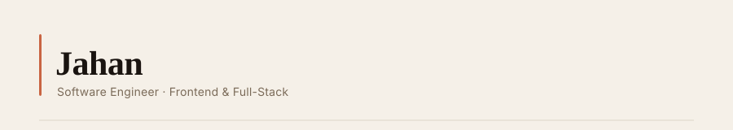

<!-- Header SVG — commit header.svg alongside this README.md -->

  

<!-- Typing animation -->

  

---

### About me

Passionate Software Engineer with 5+ years of experience across various platforms and technologies, including [award-winning mobile](https://apps.apple.com/gb/app/hour-blocks-day-planner/id1456275153#?platform=iphone) and commercial enterprise full-stack applications.

---

### 🛠 Stack

  
  
  
  
  
  
  <!--  -->

---

<!-- ### 📊 GitHub Stats -->

<!-- 

  
  

 -->

<!-- Footer SVG — commit footer.svg alongside this README.md -->
<!-- 

  

 -->
